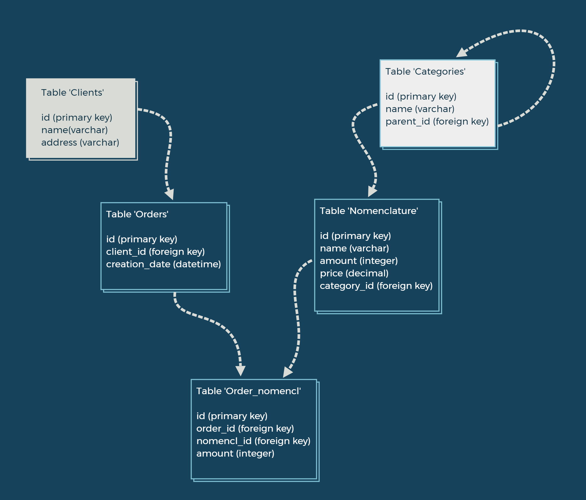

### Задание 1. Фонарь

Требуется написать управляемый по сети фонарь. Команды управления фонарь
принимает от сервера фонаря. Предполагается, что реализация сервера уже
существует (однако недоступен вам в процессе разработки клиента фонаря). Фонарь
и сервер общаются по Протоколу Управления Фонарем (ПУФ), работающему поверх
соединения TCP.
ПУФ устроен следующим образом. Для изменения состояния фонаря сервер
передает ему команду управления. Все команды передаются в формате json вида:
```
{
"command" = text,
"metadata" = double
}
```

ПУФ версии 1 описывает три команды:

    • ON (включить фонарь),
    • OFF (выключить фонарь)
    • COLOR (сменить цвет)
    
Цвет (при необходимости) кладется в поле метадата.
Реализация фонаря должна удовлетворять следующим требованиям:

1. При запуске фонарь должен запрашивать хост:порт (по умолчанию
127.0.0.1:9999), подсоединяться по TCP и после этого начать
отрабатывать протокол управления.
2. При получении данных от сервера фонарь проверяет команду,
и, если она известна, обрабатывает команду, иначе молча ее игнорирует.
3. При получении команды ON фонарь включается (отрисовку
фонаря оставляем на ваше усмотрение).
4. При получении команды OFF фонарь выключается.
5. При получении команды COLOR фонарь меняет цвет.
6. При завершении работы фонарь корректно закрывает соединение
с сервером.
7. Реализация фонаря позволяет легко добавлять любые новые команды.
Проработанность обработки исключительных ситуаций (ошибки
установления соединения, обрывы соединения) — на ваше усмотрение.

### Решение

Файл для первого задания: [lantern.py](./lantern.py) 

Юниттесты: [test.py](./test.py)

### Запуск программы:

* клонируйте репозиторий:

```
git clone https://github.com/NViQ/Lantern.git
```

* запуск:

```python
import asyncio
from lantern.lantern import main
asyncio.run(main())
```

### Задание 2. Проектирование БД.
Схема БД:

</details>

### SQL запросы:
1) Получение информации о сумме товаров заказанных под каждого клиента (Наименование клиента, сумма)
```sql
SELECT 
    clients.name as client_name,
    SUM(order_numencl.amount * nomenclature.price) as sum
FROM
    orders
JOIN order_numencl ON orders.id = order_nomencl.order_id
JOIN nomenclature ON order_nomencl.nomenc_id = nomenclature.id
JOIN clients ON orders.client_id = clients.id
GROUP BY clients.name
```
2) Найти количество дочерних элементов первого уровня вложенности для категорий номенклатуры.
```sql
SELECT 
    lvl1.name,
    (SELECT COUNT(*)
     FROM categories lvl2
     WHERE parent_id = lvl1.id) as children_amount
FROM categories as lvl1
```
